# MixedMode Modular Central (MMMC)

An expandable Eurorack CV & MIDI processor based around a Teensy 4.1

It provides `N_IO_PORT = 8` configurable input / output ports. Each port can be assigned to it's own independant algorithms. 

MMMC supports MIDI I/O over several transports : DIN Midi (3.5mm TRS) and USB MIDI and USB Host. The class compliant USB device shows up as 4 independant MIDI ports when connected to a host computer.


## Basics

The MixedMode Modular Central (MMMC) can clock off three sources:

- Internal
- CV
- MIDI

The behaviour of the rest of the module is the same regardless of the clock
source. The MMMC operates under a `PPQN = 24` master clock derived from any of
the sources listed above — see [Master clock](#master-clock).

Each I/O channel can be configured as either an **input** or an **output**. They can be assigned to their own **algorithm** or be part of an algorithm that uses multiple inputs and/or outputs.

Each MIDI I/O can be routed to each other and MIDI Modifier Algorithms can be applied independently. 

## Output Algorithms

### Clock Dividers / Multipliers

Division is an algorithm, not something every clocked algorithm carries:
`ClockDiv` is an ordinary node that writes a gate bus, and sequencers take an
edge-triggered advance inlet. So one divider can drive several sequencers —
which locks them together by construction, because they read the same edge —
a divider can divide another divider, and a sequencer can just as well be
advanced by a logic gate or an external jack.

Each `ClockDiv` has its own `phase` (a fraction of its own output period, so
it wraps inside the cycle) and `delay` (whole ticks of lag, which does not
wrap). Both are exact from the master tick. See [Master clock](#master-clock)
for what "exact" costs and where it stops.

### Gate Sequencers

Each writes a bool to a gate bus. A gate bus cannot carry pitch, velocity,
note length or polyphony, so note sequencing (#13) and drum sequencing (#14)
are separate families sharing this transport.

- `Metronome` : every advance edge is output
- `StepSequencer` : a classic step sequencer, 1..`MAX_SEQUENCE_LEN` steps, each ON/OFF
- `EuclidianSequencer` : Bjorklund's distribution of *k* pulses over *n* steps, plus rotation
- `RandomSequencer` : shred and load a random pattern

All four share one base: an advance inlet, a reset inlet, a length, a
direction (forward, reverse, ping-pong, random, Brownian), a per-step
probability and a fixed-width trigger output. Reset means the same thing in
all of them — the next advance plays the pattern's first step — and it is an
inlet, so one sequencer can reset another.

The transport underneath — step counter, length, direction, the rule for
"the next step" — is `StepEngine` (`src/algorithm/sequencer/step_engine.h`),
shared with the note and drum sequencers below, so a gate sequencer and a
note sequencer at the same length and direction visit steps identically by
construction.

### Note Sequencers

`NoteSequencer` (one voice) and `PolySequencer` (`NOTE_SEQ_VOICES = 4`
voices a step) write a note bus. Same advance and reset inlets, plus an
optional **root inlet** on a note bus.

**A step stores a scale degree, never an absolute note.** The pitch is
`root + degree_to_semitone(degree, scale)`, so changing the root transposes
the whole pattern and keeps it in key, and changing the scale gives the same
pattern a different character — both one-parameter operations on a pattern
nobody touches. The root comes from the root inlet when it is patched (last
note-on wins: play a key and the running sequence transposes) and from a
parameter otherwise. The scale is a 12-bit mask, one bit per semitone
(`src/midi/scale.h`): two bytes that cover every named mode and any user
scale. Beyond the octave, degree *n* in an *n*-note scale is the root an
octave up and negative degrees go down the same way; when the scale changes
under a pattern, degrees index the new scale's notes, so the pattern survives
as an interval shape rather than as pitches (that is what makes it different
from `Quantise`, which snaps pitches).

Per step: degree and velocity per voice, then a length, three flags (rest,
tie, accent) and a probability. Global velocity scale and offset, an accent
amount, a channel.

**Note length has one exact half and one estimated half.** Length is counted
in advance edges — a note is released on the Nth edge after the one that
played it — so ties and holds need nothing but the advance inlet and are
exactly in time. A *tie* extends every sounding note by its own length
instead of retriggering; a *rest* plays nothing while sounding notes keep
counting down. A sub-step gate (the `gate` percentage) needs the *duration*
of a step, which the sequencer only sees edges of, so it measures the
interval between the last two advances and extrapolates: wrong on the first
step after a tempo change and on any irregular trigger, the same caveat as
multiplying from a gate in `ClockDiv`, and labelled as such. Ratcheting has
the identical problem and is deliberately not built until the estimate has
proved itself on hardware.

**The sequencer owns a note-off for every note-on it emits** and releases it
with the pitch it actually sent, from the same ledger the modifiers use —
never recomputed from the current root or scale. The root moving under a held
note, the scale changing, the pattern changing, the clock stopping (after a
configurable number of silent periods the sequencer releases what it holds
rather than hanging it for ever) and the patch being swapped all release
correctly, and each has a test.

### Drum Sequencers

A drum pattern is a grid — `DRUM_SEQ_LANES = 8` lanes × up to
`MAX_SEQUENCE_LEN` steps — that a user edits as one object, so it is one
node with a `StepEngine` per lane, not eight gate sequencers. Advance and
reset are shared; **each lane has its own length**, which is polyrhythm for
free (lanes of 16 and 12 realign after 48 advances). Probability is per lane.

Two algorithms rather than one with a mode switch, because the destinations
want different things:

- `DrumSeqGate` — one gate outlet per lane, fixed-width triggers. Velocity
  has no representation in the gate domain, so accent is a second lane, the
  modular way. Lanes without a jack are left unconnected.
- `DrumSeqMidi` — one note outlet, a note number and channel per lane
  (General MIDI defaults), a velocity per cell. Every note-on is released
  after a fixed number of milliseconds from the ledger; a lane retriggered
  before then releases first, and a patch swap releases everything.

## Logic Algorithms

Configurable logic gates (all gates can also be inverted) & latches:

- `NOT`
- `AND`
- `NAND`
- `OR`
- `NOR`
- `XOR`
- `NXOR`
- `ASTABLE`
- `LATCH`

Logic algorithms are not clocked by the master clock and happen at a much higher sample rate

Decisions recorded for the logic gates:

- A gate folds its operation over every input in its mask, starting from the
  gate's identity element (1 for AND/NAND, 0 for OR/NOR/XOR/XNOR). **XOR over
  more than two inputs is therefore parity**: the output is high when an odd
  number of inputs is high. XNOR is the inverse.
- Gate inputs are normalised in the hardware layer (see `GATE_INPUT_ACTIVE_LOW`
  in `src/hardware.h`): an algorithm reads `1` when a gate is present at the
  jack and `0` otherwise, so an **unpatched input reads 0** and does not force
  an OR or XOR gate high.
- `NOT` and `Sustain` take exactly one input port. A mask selecting zero or
  several ports is rejected at construction (`is_valid()` is false) and the
  algorithm never touches the hardware.
- Ports start as inputs at boot. An algorithm claims its outputs in `setup()`
  and returns every port it claimed to an input when it is destroyed.

# Building

The toolchain is PlatformIO, installed into a project-local `.venv/`. A clone
needs nothing but `python3`:

```
make setup     # install PlatformIO and pre-fetch the toolchains (~600 MB, once)
make build     # build firmware for the Teensy 4.1
make test      # run the native unit tests, no hardware needed
make size      # flash and RAM usage
make upload    # flash an attached Teensy
```

`make` targets bootstrap PlatformIO on first use, so `make test` works in a
fresh clone on its own. Claude Code on the web provisions the same toolchain
through `.claude/hooks/session-start.sh` when a session starts.

The Teensy platform version in `platformio.ini` is pinned on purpose. The core
ships MIDI Library and USBHost_t36, so the platform pin is what makes those
dependencies reproducible — an unpinned build resolves whatever the registry
published most recently, and that has already broken this project's DIN MIDI
settings once.

Our sources are compiled with `-Wall -Wextra -Weffc++ -Wshadow -Werror`;
framework and library include paths are passed as `-isystem`
(`scripts/project_warnings.py`) so that `-Werror` judges our code and not the
Teensy core's headers, which are included through
`src/hal/teensy/teensy_includes.h`. Headers live next to their sources
under `src/`; the `include/` and `lib/` directories are not used.

## Versions and releases

`VERSION` at the repository root is the single source of truth. Every build
stamps it into the binary along with `git describe`, reachable from firmware as
`MMMC_VERSION`, `MMMC_GIT_REV` and `MMMC_BUILD` (see `src/version.h`), and
printed to the serial console at startup:

```
MMMC 0.1.0+cbb862d
```

CI builds every push and pull request, and attaches the resulting `.hex` and
`.elf` to the run for 14 days, so any branch can be flashed and tried without
cutting a release.

To publish a release:

1. Update `VERSION` and commit it.
2. Tag the commit `v<version>` and push the tag.

```
git tag -a v0.2.0 -m "MMMC 0.2.0"
git push origin v0.2.0
```

The release workflow refuses to publish if the tag and `VERSION` disagree, then
runs the tests, builds firmware, and publishes a GitHub Release carrying
`mmmc-v<version>-teensy41.hex`, the matching `.elf`, and `SHA256SUMS`.

## Tests

The hardware is behind two narrow interfaces, `IGpio` (`src/hal/igpio.h`) and
`IMidiOut` (`src/hal/imidi_out.h`). The Teensy implementations live in
`src/hal/teensy/`; the fakes used by the tests (`FakeGpio`, `RecordingMidiOut`)
live in `test/fakes/`. Everything else is framework-free and is built on the
host by the `native` environment:

```sh
pio test -e native
```

Nothing under `src/algorithm/` includes `Arduino.h`.

CI (`.github/workflows/ci.yml`) builds the firmware and runs the native tests
on every push to `main` and on every pull request.

## Emulator

The same framework-free core compiles unchanged to WebAssembly, with the
browser as the hardware: `emulator/` adds a web implementation of `IGpio` and
`IMidiOut` next to the Teensy one, and a page that loads a patch, drives the
jacks, sends MIDI and shows the buses, the jacks and the MIDI going out.

```sh
make emulator                    # needs clang and lld; no PlatformIO involved
open emulator/dist/index.html    # a single self-contained file
```

The build from `main` is published at
<https://mixedmode-fx.github.io/central/> (`.github/workflows/pages.yml`),
and CI attaches every branch's `index.html` to its run. What it can and cannot
verify, and how it was arrived at, is in `emulator/README.md`.

# Signal bus model

Algorithms do not bind to hardware. They read and write **internal buses**,
and the hardware ports are nodes too. An internal bus is a virtual patch cable.

| Domain | Carries | Buses | Fan-in rule |
|---|---|---|---|
| Gate | a level (`bool`) | 16 | OR of all writers (a passive mult) |
| Note | MIDI events (notes, CC, bend, ...) | 8 | arrival order; overflow is counted, never silent |
| CV | `int16_t` | 8 | sum with saturation (reserved for #8) |

Buses are **double-buffered**: readers see the previous pass, writers write
the next, and `BusManager::swap()` publishes. Evaluation is therefore
order-independent, feedback is a one-pass delay instead of a hang (a `NOT`
feeding itself oscillates at half the pass rate), and every pass is
deterministic. Each processing stage costs exactly one pass of latency, which
at gate rate is microseconds.

Every pass, `MixedModeMaster` runs:

1. hardware input nodes (`GateInPort`, `MidiInPort`) sample and write their buses;
2. pool nodes `process()`;
3. if a clock tick fired, nodes that subscribe `tick()` (the clock is not a bus:
   a tick carries a count, see #4);
4. swap;
5. hardware output nodes (`GateOutPort`, `MidiOutPort`) read their buses and
   drive the jacks and transports.

**Nodes.** Every algorithm is a `Node` (`src/node/node.h`). It is described by
an `AlgorithmDescriptor` in the registry (`src/node/registry.cpp`): id, name,
inlets and outlets with their *domain*, parameter count, state size, and a
placement-new constructor. A `NodeConfig` (also the preset format) selects an
algorithm by id and gives a bus index per inlet and outlet; the index is
interpreted in the domain the descriptor declares, and the validator rejects
an index that is out of range for that domain. `NO_BUS` leaves an optional
inlet unconnected.

**Allocation.** All algorithm code is always resident. Instances live in a
static pool of `N_NODE = 32` uniform slots (`NODE_SLOT_SIZE = 640` bytes each,
checked per class with `static_assert`), placement-new'd on patch load and
destroyed explicitly on unload. The slot is sized by the two largest nodes,
`PolySequencer` and `DrumSeqMidi`, at about 540 bytes each: a 32-step grid
plus the note-off ledger. The 8 jacks and the MIDI endpoints are reserved
nodes owned by the master, outside the pool, so a patch cannot delete its own
MIDI output. **There is no heap allocation after boot**; the native tests
assert it by instrumenting `operator new`.

**Parameters.** `NodeConfig` carries `N_PARAM = 336` parameter bytes, the
width of the poly and drum sequencers' step grids (a 16-byte header plus 320
bytes of steps). Every other algorithm uses the first few and leaves the rest
zero, which is what makes a `Patch` 11 KB in RAM: fine against 1 MB, but the
patch storage (#7) and the wire format (#11) will want to skip trailing zeros
rather than store them. An outlet left at `NO_BUS` is unused, not an error —
a drum sequencer with three of its eight lanes patched is the normal case.

**Handover.** Before a patch is unloaded, the master calls `Node::silence()`
on every pool node, which emits a note-off for everything the node still has
sounding, then swaps and flushes the MIDI outputs — so a patch swap under a
held chord or mid-sequence never hangs a note downstream. Node state does not
survive a swap: the new patch's nodes are constructed fresh.

Sizing constants live in `src/config.h`. Algorithm ids in
`src/node/registry.h` are part of the preset format: append, never renumber.

Algorithms available today:

| Domain | Algorithms |
|---|---|
| Logic | `NOT`, `AND`, `NAND`, `OR`, `NOR`, `XOR`, `XNOR` (up to four inlets each) |
| Clock | `ClockDiv` |
| Gate sequencers | `Metronome`, `StepSequencer`, `EuclidianSequencer`, `RandomSequencer` |
| Note sequencers | `NoteSequencer`, `PolySequencer` (degrees in a scale, from a root) |
| Drum sequencers | `DrumSeqGate` (a gate per lane), `DrumSeqMidi` (a note per lane, velocity per cell) |
| MIDI modifiers | `Transpose`, `NotePriority`, `VelocityCurve`, `Chord`, `Quantise`, `Probability`, `Arpeggiator` |
| Conversion | `Sustain` (gate to CC), `GateToNote` (gate edge to note on/off) |

# Master clock

One monotonic counter for the whole module, in **subticks**: `CLOCK_SUBTICK`
= 24 of them per PPQN tick, 576 per quarter note. The subdivision is what caps
the fastest multiplier — `xN` is exact only when N divides `CLOCK_SUBTICK` —
and 24 was chosen for its divisors, so a triplet is as exact as a duplet. That
puts the timer at 1.2 kHz at 120 BPM, for an ISR that increments one counter.

**No node's `tick()` runs in interrupt context.** The ISR increments; the main
loop reads the count through `MasterClock::consume()` and the pass does the
work, so a slow algorithm cannot stall the clock. Subticks that arrive between
two passes are collapsed into one `tick()` with the newest count — a node works
from the count, so nothing is lost.

Three sources feed that counter:

| Source | Driven by | Notes |
|---|---|---|
| Internal | the interval timer, from BPM | 20–300 BPM |
| CV | rising edges on the sync jack | `cv_ppqn` pulses per quarter |
| MIDI | MIDI clock bytes, at 24 PPQN | start / stop / continue drive the transport |

For both external sources the timer free-runs between edges at the last
measured period, and each edge re-phases the count onto its subtick boundary.
Re-phasing only ever moves the count **forward**: a node comparing two readings
never sees time reverse. An edge whose period is implausible is counted rather
than believed.

**Multiplication from a gate source is refused**, and says so. With only past
edges to go on, a multiplier has to estimate the period and extrapolate, which
puts its extra pulses in the wrong place exactly when the tempo moves — which
is when a musician notices. From the master tick, where the count is already
known, multiplication is exact. An inexact multiplier off the tick (one that
does not divide `CLOCK_SUBTICK`) is refused the same way.

Trigger width is wall-clock, never ticks. A 24-PPQN tick at 120 BPM is ~20 ms
and a Eurorack trigger is 1–10 ms, so a width in ticks would stop being a
trigger as soon as the tempo changed.

# MIDI

Two DIN ports, a four-cable class-compliant USB device and a USB host port all
feed the same algorithm graph.

**In.** Every parser is drained into one queue, tagged with the transport the
message arrived on; the transport side does nothing but enqueue, and the pass
dispatches. A full queue drops the newest message and counts it, so "MIDI went
strange under load" is a number rather than a mystery. Realtime messages
(clock, start, stop, continue) are transport-level: they reach the master clock
and no bus.

**Thru is a patch, not a default.** Library soft-thru is off on both DIN ports;
a `MidiInPort` and a `MidiOutPort` on a shared note bus give thru back when
somebody asks for it. That is also the clearest demonstration that routing is
just bus assignment.

**Modifiers** all compose over one held-note model (`src/midi/held_notes.h`):
which notes are held, in what order, at what velocity. The rule that governs
every one of them is that **a modifier owns the note-off for every note-on it
emitted, and releases it with the transformation it originally applied, not the
current parameter value** — otherwise moving a transpose offset, or a
quantiser's root, under a held note hangs it on the downstream synth for ever.
A modifier that cannot record an emission does not make it.

# Code structure

Everything is a `Node`. A node reads and writes bus indices and never names a
pin or a transport; only the hardware port nodes hold an `IGpio` or an
`IMidiOut`. `MixedModeMaster` owns the clock, the buses, the reserved port
nodes and the pool, and runs the evaluation order every pass.

Note what the diagram does *not* contain: a `Clock` inside every clocked
algorithm. Division is `ClockDiv`, a node like any other, and a sequencer
takes an edge on a gate bus. The three sequencer families share one
`StepEngine` and differ only in what a step holds and which bus it writes.

```mermaid
classDiagram

    class MixedModeMaster{
        + MasterClock clock
        + BusManager buses
        + NodePool pool
        + GateInPort/GateOutPort ports[GPIO_N]
        + MidiInPort/MidiOutPort midi[]
        + LoadError load(Patch)
        + void pass(uint32_t now_us)
        + uint8_t deliver_midi(source, event, now_us)
    }

    class MasterClock{
        + uint32_t subticks
        + uint8_t source
        + void advance()
        + void external_edge(uint32_t now_us)
        + bool consume(uint32_t&)
    }

    class BusManager{
        + gate_read/gate_write
        + note_read/note_write
        + cv_read/cv_write
        + void swap()
    }

    class Node{
        + void setup()
        + void process(BusManager&, uint32_t now_us)
        + void tick(BusManager&, uint32_t count)
        + void silence(BusManager&)
    }

    MixedModeMaster *-- MasterClock
    MixedModeMaster *-- BusManager
    MixedModeMaster *-- Node

    Node --|> ClockDiv
    Node --|> GateSequencer
    Node --|> LogicGate
    Node --|> HardwarePort
    Node --|> MidiModifier

    class ClockDiv{
        + uint8_t mode
        + uint8_t amount
        + uint8_t phase
        + uint8_t delay
        + TriggerPulse pulse
    }

    class StepEngine{
        + uint8_t length
        + uint8_t direction
        + uint8_t advance(rng)
        + void reset()
    }

    class GateSequencer{
        + StepEngine engine
        + uint8_t probability[]
        + bool step_on(uint8_t)
    }
    GateSequencer *-- StepEngine
    GateSequencer --|> Metronome
    GateSequencer --|> StepSequencer
    GateSequencer --|> EuclidianSequencer
    GateSequencer --|> RandomSequencer

    class NoteSequencerBase{
        + StepEngine engine
        + uint16_t scale_mask
        + uint8_t root
        + SoundingNotes sounding
        + uint8_t pitch(step, voice)
    }
    Node --|> NoteSequencerBase
    NoteSequencerBase *-- StepEngine
    NoteSequencerBase --|> NoteSequencer
    NoteSequencerBase --|> PolySequencer

    class DrumSequencer{
        + StepEngine lanes[8]
        + bool hit(lane, step)
    }
    Node --|> DrumSequencer
    DrumSequencer *-- StepEngine
    DrumSequencer --|> DrumSeqGate
    DrumSequencer --|> DrumSeqMidi

    LogicGate --|> NOT
    LogicGate --|> AND
    LogicGate --|> OR
    LogicGate --|> XOR

    class MidiModifier{
        + HeldNotes held
        + SoundingNotes sounding
    }
    MidiModifier --|> Transpose
    MidiModifier --|> NotePriority
    MidiModifier --|> VelocityCurve
    MidiModifier --|> Chord
    MidiModifier --|> Quantise
    MidiModifier --|> Probability
    MidiModifier --|> Arpeggiator

    class HardwarePort
    HardwarePort --|> GateInPort
    HardwarePort --|> GateOutPort
    HardwarePort --|> MidiInPort
    HardwarePort --|> MidiOutPort

```



# Control & Feedback

The module has one encoder and two switches.
Each output has an RGB LED indicating the signal status and algorithm used.
A small square OLED is present to help with settings

A tight integration with Novation Launchpads using the DAW mode would be great. This would allow for additional control and feedback.