# MixedMode Modular Central (MMMC)

An expandable Eurorack CV & MIDI processor based around a Teensy 4.1

It provides `N_IO_PORT = 8` configurable input / output ports. Each port can be assigned to it's own independant algorithms. 

MMMC supports MIDI I/O over several transports : DIN Midi (3.5mm TRS) and USB MIDI and USB Host. The class compliant USB device shows up as 4 independant MIDI ports when connected to a host computer.


## Basics

The MixedMode Modular Central (MMMC) can clock off three sources:

- Internal
- CV
- MIDI

The behaviour of the rest of the module is the same regardless of the clock
source. The MMMC operates under a `PPQN = 24` master clock derived from any of
the sources listed above — see [Master clock](#master-clock).

Each I/O channel can be configured as either an **input** or an **output**. They can be assigned to their own **algorithm** or be part of an algorithm that uses multiple inputs and/or outputs.

Each MIDI I/O can be routed to each other and MIDI Modifier Algorithms can be applied independently. 

## Output Algorithms

### Clock Dividers / Multipliers

Division is an algorithm, not something every clocked algorithm carries:
`ClockDiv` is an ordinary node that writes a gate bus, and sequencers take an
edge-triggered advance inlet. So one divider can drive several sequencers —
which locks them together by construction, because they read the same edge —
a divider can divide another divider, and a sequencer can just as well be
advanced by a logic gate or an external jack.

Each `ClockDiv` has its own `phase` (a fraction of its own output period, so
it wraps inside the cycle) and `delay` (whole ticks of lag, which does not
wrap). Both are exact from the master tick. See [Master clock](#master-clock)
for what "exact" costs and where it stops.

### Metronome

`ClockDiv` is the exact instrument, and exact is not the same as usable: its
amount is a count of PPQN ticks, so "one pulse per beat" is `/24`, a dotted
eighth is `/18`, and a sixteenth-note triplet is `/4` — and none of those is
readable as a note value unless you already know `MASTER_PPQN` is 24. Every
one of them is a sum a musician has to do before hearing anything, and getting
it wrong sounds like a tempo mistake rather than an arithmetic one.

`Metronome` is the same clock said the way a musician says it. Two controls:

- **division** — `8 bars`, `4 bars`, `2 bars`, `1 bar`, `1/2`, `1/4`, `1/8`,
  `1/16`, `1/32`, `1/64`. A bar is four quarter notes; the module has no time
  signature, and 4/4 is the only reading of "bar" that needs no other
  information.
- **feel** — `straight`, `dotted` (×3/2) or `triplet` (×2/3).

Nothing is given up for the friendlier control. **Every one of the thirty
rates is a whole number of subticks**, so a `Metronome` is exactly as tight as
the `ClockDiv` it replaces — a quarter note and `/24` fire on the same subtick
for as long as they both run, which is what `test_clock` asserts. The binding
case is the fastest value: a dotted 1/64 is three quarters over thirty-two and
a 1/64 triplet is a quarter over twenty-four, both exact because the quarter
is 576 subticks. A `static_assert` in `metronome.cpp` fails the build if
`config.h` ever moves out from under that.

It takes a **reset inlet** and nothing else: a rising edge is a downbeat, so
the grid re-anchors on it and the next division is counted from there. The
divider is still there for the rates this list does not name — and since
`ClockDiv` accepts a gate source, a `Metronome` into a `ClockDiv` is how one
gets built.

`Metronome` used to be a gate sequencer: a `StepSequencer` of length one that
passed every advance edge through. A one-step pattern gives a length, a
direction, a reset and thirty-two per-step probabilities nothing to do, and
the rate was always the divider's upstream — so the controls said a great deal
and none of it about the rate.

### Gate Sequencers

Each writes a bool to a gate bus. A gate bus cannot carry pitch, velocity,
note length or polyphony, so note sequencing (#13) and drum sequencing (#14)
are separate families sharing this transport.

- `StepSequencer` : a classic step sequencer, 1..`MAX_SEQUENCE_LEN` steps, each ON/OFF
- `EuclidianSequencer` : Bjorklund's distribution of *k* pulses over *n* steps, plus rotation
- `RandomSequencer` : shred and load a random pattern

All three share one base: an advance inlet, a reset inlet, a length, a
direction (forward, reverse, ping-pong, random, Brownian), a per-step
probability and a fixed-width trigger output. Reset means the same thing in
all of them — the next advance plays the pattern's first step — and it is an
inlet, so one sequencer can reset another.

The transport underneath — step counter, length, direction, the rule for
"the next step" — is `StepEngine` (`src/algorithm/sequencer/step_engine.h`),
shared with the note and drum sequencers below, so a gate sequencer and a
note sequencer at the same length and direction visit steps identically by
construction.

### Note Sequencers

`NoteSequencer` (one voice) and `PolySequencer` (`NOTE_SEQ_VOICES = 4`
voices a step) write a note bus. Same advance and reset inlets, plus an
optional **root inlet** on a note bus.

**A step stores a scale degree, never an absolute note.** The pitch is
`root + degree_to_semitone(degree, scale)`, so changing the root transposes
the whole pattern and keeps it in key, and changing the scale gives the same
pattern a different character — both one-parameter operations on a pattern
nobody touches. The root comes from the root inlet when it is patched (last
note-on wins: play a key and the running sequence transposes) and from a
parameter otherwise. The scale is a 12-bit mask, one bit per semitone
(`src/midi/scale.h`): two bytes that cover every named mode and any user
scale. Beyond the octave, degree *n* in an *n*-note scale is the root an
octave up and negative degrees go down the same way; when the scale changes
under a pattern, degrees index the new scale's notes, so the pattern survives
as an interval shape rather than as pitches (that is what makes it different
from `NoteQuantise`, which snaps pitches). A pattern that names no scale of
its own follows the module's key — see [The key](#the-key).

Per step: degree and velocity per voice, then a length, three flags (rest,
tie, accent) and a probability. Global velocity scale and offset, an accent
amount, a channel.

**Note length has one exact half and one estimated half.** Length is counted
in advance edges — a note is released on the Nth edge after the one that
played it — so ties and holds need nothing but the advance inlet and are
exactly in time. A *tie* extends every sounding note by its own length
instead of retriggering; a *rest* plays nothing while sounding notes keep
counting down. A sub-step gate (the `gate` percentage) needs the *duration*
of a step, which the sequencer only sees edges of, so it measures the
interval between the last two advances and extrapolates: wrong on the first
step after a tempo change and on any irregular trigger, the same caveat as
multiplying from a gate in `ClockDiv`, and labelled as such. Ratcheting has
the identical problem and is deliberately not built until the estimate has
proved itself on hardware.

**The sequencer owns a note-off for every note-on it emits** and releases it
with the pitch it actually sent, from the same ledger the modifiers use —
never recomputed from the current root or scale. The root moving under a held
note, the scale changing, the pattern changing, the clock stopping (after a
configurable number of silent periods the sequencer releases what it holds
rather than hanging it for ever) and the patch being swapped all release
correctly, and each has a test.

### Drum Sequencers

A drum pattern is a grid — `DRUM_SEQ_LANES = 8` lanes × up to
`MAX_SEQUENCE_LEN` steps — that a user edits as one object, so it is one
node with a `StepEngine` per lane, not eight gate sequencers. Advance and
reset are shared; **each lane has its own length**, which is polyrhythm for
free (lanes of 16 and 12 realign after 48 advances). Probability is per lane.

Two algorithms rather than one with a mode switch, because the destinations
want different things:

- `DrumSeqGate` — one gate outlet per lane, fixed-width triggers. Velocity
  has no representation in the gate domain, so accent is a second lane, the
  modular way. Lanes without a jack are left unconnected.
- `DrumSeqMidi` — one note outlet, a note number and channel per lane
  (General MIDI defaults), a velocity per cell. Every note-on is released
  after a fixed number of milliseconds from the ledger; a lane retriggered
  before then releases first, and a patch swap releases everything.

## Utility Algorithms

### GateHold

Every clock source in this module makes a **trigger** — `TRIGGER_WIDTH_US`, 5 ms
(`src/config.h`) — because a trigger whose width followed the tempo would stop
being a trigger. That is right for clocking things and useless for the other
half of what a gate is for: opening an envelope, latching a mute, holding a
note down. `GateHold` is the piece between the two.

| Mode | What it does |
|---|---|
| `latch` | a rising edge on `set` raises the output and it stays up; a rising edge on `reset` drops it. An SR latch — the mode that answers "hold a gate high until I say otherwise" |
| `toggle` | each rising edge on `set` flips the output; `reset` still drops it. One button, two states |
| `extend` | a minimum length: the output follows `set` but stays up for at least `hold`, retriggering cleanly. This is what turns a 5 ms trigger into a gate |
| `limit` | a maximum length: the output drops after `hold` even if the input is still up, and does not rise again until the input has gone low and come back |

`reset` is optional — a latch with nothing patched to it holds until the patch
changes, which is a legitimate thing to ask for. **Reset wins**: an edge on
`reset` in the same pass as one on `set` leaves the output low, in every mode.
Changing the mode does not clear the output: a mode change is not a reset, and
silently dropping a gate somebody is holding is worse than either reading.

## Modulators

Modulators write a **CV bus** — the internal control bus described under
[Signal bus model](#signal-bus-model) — and the
[modulation matrix](#modulation-a-control-signal-reaching-a-parameter) turns
that signal into parameter writes. Nothing about a modulator knows what it is
modulating: it produces a signal, the matrix decides what the signal reaches,
and one LFO can drive four parameters at four depths without four LFOs.

### LFO

Seven shapes — sine, triangle, ramp up, ramp down, square, random step, random
glide — with depth, offset, start phase and a bipolar/unipolar choice.

**Two rates, and only one of them is a guess.** Synced to the master clock the
cycle is a note value from the same list `Metronome` offers, counted in
subticks, so an LFO set to `1/4` and a Metronome set to `1/4` are locked
together for ever and neither drifts. Free-running the cycle is wall-clock
time in tenths of a hertz, 0.1 Hz to 25.5 Hz — which is what a modulator that
should *not* line up with the music needs, and a synced one cannot express.

A synced LFO's cycle is anchored on **subtick zero**, not on whichever subtick
the node was constructed on, so an LFO added to a patch that has been running
for an hour is in phase with the Metronome beside it. The optional `reset`
inlet is the one thing that moves the anchor. Changing the rate or the
division re-derives the period **without moving the phase**: a rate swept
under a running modulation sweeps continuously instead of jumping back to the
top of its cycle, the same rule `ClockDiv` follows for a pulse it has already
scheduled.

### SampleHold

One reading of a control signal, held until the next trigger. With nothing
patched to `signal` it samples its own noise, which is the classic patch — a
random level per step, held steady between steps — and with something patched
it holds a reading of that, which is how a slow LFO becomes a stepped sequence
locked to the clock. `sample` reads on the rising edge; `track` follows the
input for as long as the trigger is up and freezes on the fall. `steps`
quantises what is held onto that many evenly spaced levels; at 0 or 1 the full
twelve bits are held.

### Slew

What a value is allowed to change by, per unit of time — the node that turns a
step into a glide. Rise and fall are separate (a fast attack and a slow decay
out of a sample and hold is an envelope; one rate for both is not) and `link`
ties them for the case where they are not. Times are **per full scale**, in
tens of milliseconds, so two different step sizes glide at the same speed
rather than taking the same time.

Smoothing is a signal operation, so it belongs in the signal path where it can
be shared, metered and patched around — which is why the modulation matrix has
no smoothing control of its own.

## Logic Algorithms

Configurable logic gates (all gates can also be inverted) & latches:

- `NOT`
- `AND`
- `NAND`
- `OR`
- `NOR`
- `XOR`
- `NXOR`
- `ASTABLE`
- `LATCH`

Logic algorithms are not clocked by the master clock and happen at a much higher sample rate

Decisions recorded for the logic gates:

- A gate folds its operation over every input in its mask, starting from the
  gate's identity element (1 for AND/NAND, 0 for OR/NOR/XOR/XNOR). **XOR over
  more than two inputs is therefore parity**: the output is high when an odd
  number of inputs is high. XNOR is the inverse.
- Gate inputs are normalised in the hardware layer (see `GATE_INPUT_ACTIVE_LOW`
  in `src/hardware.h`): an algorithm reads `1` when a gate is present at the
  jack and `0` otherwise, so an **unpatched input reads 0** and does not force
  an OR or XOR gate high.
- `NOT` and `Sustain` take exactly one input port. A mask selecting zero or
  several ports is rejected at construction (`is_valid()` is false) and the
  algorithm never touches the hardware.
- Ports start as inputs at boot. An algorithm claims its outputs in `setup()`
  and returns every port it claimed to an input when it is destroyed.

# Building

The toolchain is PlatformIO, installed into a project-local `.venv/`. A clone
needs nothing but `python3`:

```
make setup     # install PlatformIO and pre-fetch the toolchains (~600 MB, once)
make build     # build firmware for the Teensy 4.1
make test      # run the native unit tests, no hardware needed
make size      # flash and RAM usage
make upload    # flash an attached Teensy
```

`make` targets bootstrap PlatformIO on first use, so `make test` works in a
fresh clone on its own. Claude Code on the web provisions the same toolchain
through `.claude/hooks/session-start.sh` when a session starts.

The Teensy platform version in `platformio.ini` is pinned on purpose. The core
ships MIDI Library and USBHost_t36, so the platform pin is what makes those
dependencies reproducible — an unpinned build resolves whatever the registry
published most recently, and that has already broken this project's DIN MIDI
settings once.

Our sources are compiled with `-Wall -Wextra -Weffc++ -Wshadow -Werror`;
framework and library include paths are passed as `-isystem`
(`scripts/project_warnings.py`) so that `-Werror` judges our code and not the
Teensy core's headers, which are included through
`src/hal/teensy/teensy_includes.h`. Headers live next to their sources
under `src/`; the `include/` and `lib/` directories are not used.

## Versions and releases

`VERSION` at the repository root is the single source of truth. Every build
stamps it into the binary along with `git describe`, reachable from firmware as
`MMMC_VERSION`, `MMMC_GIT_REV` and `MMMC_BUILD` (see `src/version.h`), and
printed to the serial console at startup:

```
MMMC 0.1.0+cbb862d
```

CI builds every push and pull request, and attaches the resulting `.hex` and
`.elf` to the run for 14 days, so any branch can be flashed and tried without
cutting a release.

To publish a release:

1. Update `VERSION` and commit it.
2. Tag the commit `v<version>` and push the tag.

```
git tag -a v0.2.0 -m "MMMC 0.2.0"
git push origin v0.2.0
```

The release workflow refuses to publish if the tag and `VERSION` disagree, then
runs the tests, builds firmware, and publishes a GitHub Release carrying
`mmmc-v<version>-teensy41.hex`, the matching `.elf`, and `SHA256SUMS`.

## Tests

The hardware is behind two narrow interfaces, `IGpio` (`src/hal/igpio.h`) and
`IMidiOut` (`src/hal/imidi_out.h`). The Teensy implementations live in
`src/hal/teensy/`; the fakes used by the tests (`FakeGpio`, `RecordingMidiOut`)
live in `test/fakes/`. Everything else is framework-free and is built on the
host by the `native` environment:

```sh
pio test -e native
```

Nothing under `src/algorithm/` includes `Arduino.h`.

CI (`.github/workflows/ci.yml`) builds the firmware and runs the native tests
on every push to `main` and on every pull request.

## The module in a browser

The same framework-free core compiles unchanged to WebAssembly, with the
browser as the hardware: `emulator/` adds a web implementation of `IGpio` and
`IMidiOut` next to the Teensy one, and `app/` is the app that drives it — the
patch editor and the emulator, which are one program because the module in the
page is both the thing being edited and the thing running.

```sh
make app                         # needs clang, lld and node; no PlatformIO
open emulator/dist/index.html    # a single self-contained file
```

The build from `main` is published at
<https://mixedmode-fx.github.io/central/> (`.github/workflows/pages.yml`),
and CI attaches every branch's `index.html` to its run. What the WebAssembly
build can and cannot verify, and how it was arrived at, is in
`emulator/README.md`; the app is `app/README.md`.

# Signal bus model

Algorithms do not bind to hardware. They read and write **internal buses**,
and the hardware ports are nodes too. An internal bus is a virtual patch cable.

| Domain | Carries | Buses | Fan-in rule |
|---|---|---|---|
| Gate | a level (`bool`) | 16 | OR of all writers (a passive mult) |
| Note | MIDI events (notes, CC, bend, ...) | 8 | arrival order; overflow is counted, never silent |
| CV | `int16_t`, 12-bit full scale | 8 | sum with saturation |

**The CV domain is the internal control bus.** A modulator writes it, the
modulation matrix reads it and turns it into parameter writes, and #8's jacks
will read and write it as voltage. It is deliberately not the note bus: a note
bus carries MIDI events, whose data bytes are seven bits, so a modulator sent
that way would arrive at 128 steps and would have to invent a controller
number to be recognised by. A control signal is a *value*, not an event — it
has a level every pass whether or not anything changed, which is what a bus of
`int16_t` already is.

Full scale is **twelve bits**: `CV_FULL = 4096`, unipolar `0 .. 4095`, bipolar
`-2048 .. 2047` (`src/bus/domain.h`). Seven bits is 128 steps across a
parameter's whole range, which is audible as stepping on anything worth
modulating — a filter sweep, a detune, a slow glide — and twelve is finer than
any parameter the module has (a parameter byte is eight bits) and matches the
12-bit DAC a jack would use, so the matrix rounds *down* into the target's
range rather than interpolating up from something coarser. It is not fourteen
because fan-in is a sum and the bus is an `int16_t`: at twelve bits, all eight
buses' worth of writers at full positive scale come to 32768, one LSB past
`INT16_MAX`, so eight modulators summed on one bus clip by a single step at
the very top and nowhere else. At fourteen bits, two writers would clip.

Buses are **double-buffered**: readers see the previous pass, writers write
the next, and `BusManager::swap()` publishes. Evaluation is therefore
order-independent, feedback is a one-pass delay instead of a hang (a `NOT`
feeding itself oscillates at half the pass rate), and every pass is
deterministic. Each processing stage costs exactly one pass of latency, which
at gate rate is microseconds.

Every pass, `MixedModeMaster` runs:

1. hardware input nodes (`GateInPort`, `MidiInPort`) sample and write their buses;
2. pool nodes `process()`;
3. if a clock tick fired, nodes that subscribe `tick()` (the clock is not a bus:
   a tick carries a count, see #4);
4. swap;
5. hardware output nodes (`GateOutPort`, `MidiOutPort`) read their buses and
   drive the jacks and transports.

**Nodes.** Every algorithm is a `Node` (`src/node/node.h`). It is described by
an `AlgorithmDescriptor` in the registry (`src/node/registry.cpp`): id, name,
inlets and outlets with their *domain*, parameter count, state size, and a
placement-new constructor. A `NodeConfig` (also the preset format) selects an
algorithm by id and gives a bus index per inlet and outlet; the index is
interpreted in the domain the descriptor declares, and the validator rejects
an index that is out of range for that domain. `NO_BUS` leaves an optional
inlet unconnected.

**Allocation.** All algorithm code is always resident. Instances live in a
static pool of `N_NODE = 32` uniform slots (`NODE_SLOT_SIZE = 640` bytes each,
checked per class with `static_assert`), placement-new'd on patch load and
destroyed explicitly on unload. The slot is sized by the two largest nodes,
`PolySequencer` and `DrumSeqMidi`, at about 540 bytes each: a 32-step grid
plus the note-off ledger. The 8 jacks and the MIDI endpoints are reserved
nodes owned by the master, outside the pool, so a patch cannot delete its own
MIDI output. **There is no heap allocation after boot**; the native tests
assert it by instrumenting `operator new`.

**Parameters.** `NodeConfig` carries `N_PARAM = 336` parameter bytes, the
width of the poly and drum sequencers' step grids (a 16-byte header plus 320
bytes of steps). Every other algorithm uses the first few and leaves the rest
zero, which is what makes a `Patch` 11 KB in RAM: fine against 1 MB, but the
patch storage (#7) and the wire format (#11) will want to skip trailing zeros
rather than store them. An outlet left at `NO_BUS` is unused, not an error —
a drum sequencer with three of its eight lanes patched is the normal case.

**Handover.** Before a patch is unloaded, the master calls `Node::silence()`
on every pool node, which emits a note-off for everything the node still has
sounding, then swaps and flushes the MIDI outputs — so a patch swap under a
held chord or mid-sequence never hangs a note downstream. Node state does not
survive a swap: the new patch's nodes are constructed fresh.

Sizing constants live in `src/config.h`. Algorithm ids in
`src/node/registry.h` are part of the preset format: append, never renumber.

Algorithms available today:

| Domain | Algorithms |
|---|---|
| Logic | `NOT`, `AND`, `NAND`, `OR`, `NOR`, `XOR`, `XNOR` (up to four inlets each) |
| Clock | `ClockDiv`, `Metronome` (the clock in note values) |
| Gate sequencers | `StepSequencer`, `EuclidianSequencer`, `RandomSequencer` |
| Note sequencers | `NoteSequencer`, `PolySequencer` (degrees in a scale, from a root) |
| Drum sequencers | `DrumSeqGate` (a gate per lane), `DrumSeqMidi` (a note per lane, velocity per cell) |
| MIDI modifiers | `Transpose`, `NotePriority`, `VelocityCurve`, `Chord`, `NoteQuantise`, `Probability`, `Arpeggiator` |
| Conversion | `Sustain` (gate to CC), `GateToNote` (gate edge to note on/off) |
| Utility | `GateHold` (latch, toggle, extend or limit a gate) |
| Modulators | `LFO`, `SampleHold`, `Slew` (all write a CV bus) |

# Master clock

One monotonic counter for the whole module, in **subticks**: `CLOCK_SUBTICK`
= 24 of them per PPQN tick, 576 per quarter note. The subdivision is what caps
the fastest multiplier — `xN` is exact only when N divides `CLOCK_SUBTICK` —
and 24 was chosen for its divisors, so a triplet is as exact as a duplet. That
puts the timer at 1.2 kHz at 120 BPM, for an ISR that increments one counter.

**No node's `tick()` runs in interrupt context.** The ISR increments; the main
loop reads the count through `MasterClock::consume()` and the pass does the
work, so a slow algorithm cannot stall the clock. Subticks that arrive between
two passes are collapsed into one `tick()` with the newest count — a node works
from the count, so nothing is lost.

Three sources feed that counter:

| Source | Driven by | Notes |
|---|---|---|
| Internal | the interval timer, from BPM | 20–300 BPM |
| CV | rising edges on the sync jack | `cv_ppqn` pulses per quarter |
| MIDI | MIDI clock bytes, at 24 PPQN | start / stop / continue drive the transport |

For both external sources the timer free-runs between edges at the last
measured period, and each edge re-phases the count onto its subtick boundary.
Re-phasing only ever moves the count **forward**: a node comparing two readings
never sees time reverse. An edge whose period is implausible is counted rather
than believed.

**Multiplication from a gate source is refused**, and says so. With only past
edges to go on, a multiplier has to estimate the period and extrapolate, which
puts its extra pulses in the wrong place exactly when the tempo moves — which
is when a musician notices. From the master tick, where the count is already
known, multiplication is exact. An inexact multiplier off the tick (one that
does not divide `CLOCK_SUBTICK`) is refused the same way.

Trigger width is wall-clock, never ticks. A 24-PPQN tick at 120 BPM is ~20 ms
and a Eurorack trigger is 1–10 ms, so a width in ticks would stop being a
trigger as soon as the tempo changed.

# MIDI

Two DIN ports, a four-cable class-compliant USB device and a USB host port all
feed the same algorithm graph.

**In.** Every parser is drained into one queue, tagged with the transport the
message arrived on; the transport side does nothing but enqueue, and the pass
dispatches. A full queue drops the newest message and counts it, so "MIDI went
strange under load" is a number rather than a mystery. Realtime messages
(clock, start, stop, continue) are transport-level: they reach the master clock
and no bus.

**Thru is a patch, not a default.** Library soft-thru is off on both DIN ports;
a `MidiInPort` and a `MidiOutPort` on a shared note bus give thru back when
somebody asks for it. That is also the clearest demonstration that routing is
just bus assignment.

**Modifiers** all compose over one held-note model (`src/midi/held_notes.h`):
which notes are held, in what order, at what velocity. The rule that governs
every one of them is that **a modifier owns the note-off for every note-on it
emitted, and releases it with the transformation it originally applied, not the
current parameter value** — otherwise moving a transpose offset, or a
quantiser's root, under a held note hangs it on the downstream synth for ever.
A modifier that cannot record an emission does not make it.

**`Arpeggiator` holds.** A module with no keyboard attached needs the figure
to keep running with nobody touching one, so hold latches the chord: it is a
parameter and an optional gate inlet, either one on its own, so a footswitch
on a jack and an editor do the same thing. It is deliberately not a sustain
pedal — while hold is on, the *next* note-on played after every key has been
released replaces the figure rather than adding to it, which is what every
hardware arpeggiator does and the reason is that adding makes the chord grow
by one note every time a player fumbles a change. Adding is still possible:
keep one key down and play the rest. Taking hold off keeps whatever is still
physically held and drops only the rest, so lifting the latch under your
fingers does not cut the notes you are actually playing — and everything the
latch was keeping is released, because a latched note is still a note this
node owes a note-off.

## The key

**`NoteQuantise` is called that, and not `Quantise`, because this module
quantises two unrelated things**: a pitch to a scale, and a patch swap to a
bar. A name that does not say which is a name a user has to guess at.

Several algorithms have a scale — `NoteQuantise` snaps to one, `Chord` voices
its intervals in one, `NoteSequencer` and `PolySequencer` pick degrees out of
one — and having a copy each is right for the algorithm and wrong for the
instrument: changing key meant editing four nodes and hoping they agreed. So
the key is one setting for the module, a scale and a root, carried in the
patch's `GlobalSettings` (`src/midi/global_scale.h`).

**It is the default, and an algorithm overrides it by naming a scale.** That
falls out of a convention the module already had — a zero parameter byte means
the default (`src/node/param.h`) — so a scale parameter left alone follows the
key, and `ScaleId` 0 is `SCALE_GLOBAL` rather than a mode. Chromatic is still
selectable, appended at the end of the list, and is what a node uses to opt
out of the key entirely. Following the module's scale means following its
root as well, because a scale without a root is not a key; a patched root
inlet outranks both, because a cable is the most explicit thing a user can
say. The note sequencers are the exception to the root half: theirs is an
absolute pitch naming the octave the pattern starts in, and a pitch class
cannot say that, so they take the scale and keep their own root.

The module is chromatic until a key is set, so **a patch written before this
existed plays exactly the notes it always did.** Set it from the console
(`key`), from a host over `SYSEX_SET_GLOBALS`, or in the app under MIDI;
either way it is saved with the patch and pushed to the graph by
`PatchManager::push_globals()`, the same route the tempo takes.

`Chord`'s intervals are **steps of that scale**, which is the same thing as
semitones when the scale is chromatic — so 0 2 4 is a diatonic triad on every
degree, and the fixed semitone stack it always was when nothing names a key.

# Code structure

Everything is a `Node`. A node reads and writes bus indices and never names a
pin or a transport; only the hardware port nodes hold an `IGpio` or an
`IMidiOut`. `MixedModeMaster` owns the clock, the buses, the reserved port
nodes and the pool, and runs the evaluation order every pass.

Note what the diagram does *not* contain: a `Clock` inside every clocked
algorithm. Division is `ClockDiv`, a node like any other, and a sequencer
takes an edge on a gate bus. The three sequencer families share one
`StepEngine` and differ only in what a step holds and which bus it writes.

```mermaid
classDiagram

    class MixedModeMaster{
        + MasterClock clock
        + BusManager buses
        + NodePool pool
        + GateInPort/GateOutPort ports[GPIO_N]
        + MidiInPort/MidiOutPort midi[]
        + LoadError load(Patch)
        + void pass(uint32_t now_us)
        + uint8_t deliver_midi(source, event, now_us)
    }

    class MasterClock{
        + uint32_t subticks
        + uint8_t source
        + void advance()
        + void external_edge(uint32_t now_us)
        + bool consume(uint32_t&)
    }

    class BusManager{
        + gate_read/gate_write
        + note_read/note_write
        + cv_read/cv_write
        + void swap()
    }

    class Node{
        + void setup()
        + void process(BusManager&, uint32_t now_us)
        + void tick(BusManager&, uint32_t count)
        + void silence(BusManager&)
    }

    MixedModeMaster *-- MasterClock
    MixedModeMaster *-- BusManager
    MixedModeMaster *-- Node

    Node --|> ClockDiv
    Node --|> Metronome
    Node --|> GateSequencer
    Node --|> LogicGate
    Node --|> HardwarePort
    Node --|> MidiModifier

    class ClockDiv{
        + uint8_t mode
        + uint8_t amount
        + uint8_t phase
        + uint8_t delay
        + TriggerPulse pulse
    }

    class Metronome{
        + uint8_t division
        + uint8_t feel
        + uint32_t period
        + TriggerPulse pulse
    }

    class StepEngine{
        + uint8_t length
        + uint8_t direction
        + uint8_t advance(rng)
        + void reset()
    }

    class GateSequencer{
        + StepEngine engine
        + uint8_t probability[]
        + bool step_on(uint8_t)
    }
    GateSequencer *-- StepEngine
    GateSequencer --|> StepSequencer
    GateSequencer --|> EuclidianSequencer
    GateSequencer --|> RandomSequencer

    class NoteSequencerBase{
        + StepEngine engine
        + uint16_t scale_mask
        + uint8_t root
        + SoundingNotes sounding
        + uint8_t pitch(step, voice)
    }
    Node --|> NoteSequencerBase
    NoteSequencerBase *-- StepEngine
    NoteSequencerBase --|> NoteSequencer
    NoteSequencerBase --|> PolySequencer

    class DrumSequencer{
        + StepEngine lanes[8]
        + bool hit(lane, step)
    }
    Node --|> DrumSequencer
    DrumSequencer *-- StepEngine
    DrumSequencer --|> DrumSeqGate
    DrumSequencer --|> DrumSeqMidi

    LogicGate --|> NOT
    LogicGate --|> AND
    LogicGate --|> OR
    LogicGate --|> XOR

    class MidiModifier{
        + HeldNotes held
        + SoundingNotes sounding
    }
    MidiModifier --|> Transpose
    MidiModifier --|> NotePriority
    MidiModifier --|> VelocityCurve
    MidiModifier --|> Chord
    MidiModifier --|> NoteQuantise
    MidiModifier --|> Probability
    MidiModifier --|> Arpeggiator

    class HardwarePort
    HardwarePort --|> GateInPort
    HardwarePort --|> GateOutPort
    HardwarePort --|> MidiInPort
    HardwarePort --|> MidiOutPort

```



# Control & Feedback

**There is no human input on this module at all.** `src/hardware.h` declares
eight jacks, two DIN MIDI ports, four USB MIDI cables, a USB host port, a CV
expansion header, a KeyMech header, two consoles and two status LEDs. No
encoder, no switches, no display, and no per-output RGB LEDs. Earlier drafts
of this README promised all four; the hardware does not have them, and this
project is not going to design them in.

Two things follow, and they shape everything downstream.

**Configuration is entirely host-side.** The serial console and the SysEx
patch protocol are not conveniences sitting next to a panel menu — between
them they are the only way to configure the module.

**A bad patch must never be able to lock you out.** With no button to hold at
power-on there is no hardware recovery path, so the console and the protocol
run independently of whatever patch is loaded: neither is a graph node,
neither is reachable from a bus, and a patch cannot disable either or reroute
the port it talks through. A module that could be bricked by a malformed patch
would be a module you have to reflash over USB to recover.

## The two status LEDs

`GREEN_LED` (pin 36) and `RED_LED` (pin 37) are the module's entire feedback
surface. Both are PWM-capable on a Teensy 4.1, so brightness is a second
dimension and the vocabulary uses it. It is worth learning, because it is the
only way the module explains itself without a host attached:

| What you see | What it means |
|---|---|
| Green, bright flash on the beat | The clock is running. The flash rate *is* the tempo. |
| Green, slow dim pulse | Alive, but no clock is running. |
| Red, solid | No valid patch: the module is running the built-in default. |
| Red, brief flash | Something was dropped or refused — a MIDI message, a full note bus, a rejected transfer or parameter write. `errors` on the console has the counters. |
| Both, alternating | Boot, and the answer to a device inquiry, so you can tell two modules apart. |

Nothing in the LED path blocks: no delays, no busy waits, and no LED work
inside a node's `process()` or `tick()`.

## Boot behaviour

There is no screen to explain a silence, so a module that appears to do
nothing must not be the normal case:

- Slot 0 of the EEPROM is loaded if it checks out.
- If it is missing or fails to validate, the **built-in default patch** runs
  instead — MIDI thru across every musical transport, a `Metronome` at a
  quarter note on jack 1 at the default tempo, and a sustain pedal input on
  jack 8. A freshly flashed
  module is therefore observably alive out of the box.
- A *corrupt* stored patch also lights the red LED solid; an *empty* store
  does not, because a new module is not a fault.
- Restoring defaults is a host-side command (`defaults` on the console, or
  SysEx) — there is no button to hold at power-on.

## Patch storage

A patch is the node list plus the bus each inlet and outlet is assigned to,
plus the global settings — clock source, tempo, PPQN. It is stored in the
Teensy 4.1's flash-emulated EEPROM (`EEPROM_BYTES` = 4284) as
`PATCH_SLOTS` = 4 independent images, each with its own magic, format version
and CRC. Slot 0 is the current patch; the rest are presets for Program Change
recall. A slot that fails its CRC cannot make the others unreadable.

`sizeof(Patch)` is about 11 KB — `N_PARAM` is 336 because the poly and drum
sequencers carry a 32-step grid — so the stored image trims every node's
parameter block at its last non-zero byte. A patch of logic and dividers is a
couple of hundred bytes. The same encoding goes on the wire, so a patch that
round-trips through the store round-trips over SysEx byte for byte.

Writes are deliberate: nothing writes flash on a parameter change. An edit
marks the patch dirty and the autosave writes slot 0 once, two seconds later,
collapsing a whole knob sweep into a single write.

> **Deferred, not rejected:** the Teensy's microSD socket would hold hundreds
> of presets, sits on dedicated SDIO pins and needs no pin from `hardware.h`,
> so it can be added later without touching the hardware surface. Out of scope
> for now because it is not declared hardware.

## The serial console

USB serial and `SERIAL_UART` (`Serial6`, 115200) both carry the same text
console. It is how anyone sees inside a running module, and it is the interim
configuration path until the SysEx protocol is finished.

| Command | What it does |
|---|---|
| `info` | Firmware build, node count, store state |
| `clock [bpm] [source]` | Show or set tempo and clock source |
| `key [scale] [root]` | Show or set the scale every algorithm follows |
| `patch` | The running patch: jacks, MIDI ports, nodes and their connections |
| `buses` | Live bus state, with the overflow counters |
| `errors` | Every counter behind the red LED |
| `algos` | Every algorithm this firmware has, with inlet and outlet counts |
| `params <node>` | One node's parameters, with ranges, defaults and enum names |
| `get` / `set <node> <param> [value]` | Read or write one parameter |
| `slots` | What each preset slot holds |
| `save` / `load` / `erase <slot>` | Preset management |
| `defaults` | Back to the built-in patch |
| `maps` / `map` / `unmap` / `learn` | Controller bindings |
| `mods` | The modulation routes, and the live level on every CV bus |
| `mod <slot> <cv bus> <node> <param> [depth] [flags]` | Point a control signal at a parameter |
| `unmod <slot>` | Forget a route |

## The patch protocol (SysEx)

Everything the console can do, a host can do over SysEx — and a few things it
cannot. The wire format *is* the patch format: a bulk transfer carries exactly
the bytes the EEPROM stores, so a patch that round-trips through the store
round-trips over the wire byte for byte, and there is no second
representation to drift.

Framing is `F0 7D <device> <command> <version> … F7`. `0x7D` is the MIDI
specification's non-commercial manufacturer ID: **it must never ship in a
product**, and a real ID from the MIDI Association is a decision for whoever
ships hardware. The version byte is in every message, not just a handshake, so
an older editor talking to newer firmware is refused per message instead of
getting half a transfer in first. Binary payloads are 7-in-8 packed, so every
byte on the wire is `<= 0x7F`.

**Discovery.** The module answers the standard Universal identity request
(`F0 7E <dev> 06 01 F7`) and blinks both LEDs, so an editor finds it among the
host's ports and a user with two modules can see which one answered. It then
reports its capabilities (`N_NODE`, bus counts per domain, `MAX_IN`/`MAX_OUT`,
`N_PARAM`, slot count and size, how many controller bindings and modulation
routes it holds, and what full scale on a control bus is) and enumerates every
algorithm and every
parameter descriptor straight off the compiled table — so an algorithm added
to the firmware appears in an editor with no editor change, and a hardcoded
list cannot silently drift.

**An algorithm describes itself, not just its shape.** The registry reply
carries a name for every inlet and every outlet and a one-line summary of the
algorithm, alongside the domains and counts. A host that has only counts can
say *in 0* and *in 1*; it cannot say which one advances the sequencer and
which one resets it, so a user has to read the firmware to patch a node.
Parameters have carried names since the parameter descriptors landed, and this
is the same argument at port scope — `test_params` fails if an algorithm in
the table ships without them. The strings are appended after the algorithm's
name rather than spliced into the record, so a host that only knows the older
layout stops where it always did and needs no version bump. The capabilities
reply grew the same way, for the same reason.

**A parameter value is eight bits and a SysEx data byte is seven.** Several
ranges reach 255, and the high byte of a step pattern *is* step 8 — so
`SYSEX_SET_PARAM` carries the eighth bit in an optional extra argument and
`SYSEX_PARAM_VALUE` answers with a 14-bit value. Truncating instead does not
round the value: writing step 8 would clear the byte and take the other seven
steps with it.

The same is true of a *descriptor*: `SYSEX_PARAM_DESC` sends `min`, `max` and
`def` as 14-bit too (protocol version 2). It did not, and a range of 0..255
arrived as 0..127 — so the app drew a slider that could not reach step 8 and
its validator refused every patch that had one, which is a pattern with a hit
on the eighth step of any lane. A truncated descriptor is worse than a
truncated value: it makes legal patches unreachable rather than wrong.

**Two tiers of write.** A bulk transfer is chunked, with a sequence number and
a checksum per chunk, and accumulates into a staging buffer: the live graph is
untouched until the last chunk has arrived and the whole image has passed the
magic, version, CRC and validator checks. An incremental edit is one message
changing one field — *node 4, inlet 0, now reads bus 6* — which under the bus
model is one byte, with no re-sort, no graph rebuild and no cycle re-check.

**What survives a change**, written down once because it is the part that
bites:

| Change | What is reconstructed |
|---|---|
| A parameter | Nothing. A running sequencer keeps its step position, a divider its phase. |
| A connection | Only the node whose connection changed. It gets its handover — every note it owns is released — and starts fresh; every other node keeps its state. |
| A port | Nothing. Port nodes are configured, not constructed. |
| A whole patch | Everything. Sequencers restart, dividers re-phase onto the master count. |

**Program Change recall** is **off by default**, and both the listening
channel and the port are configurable. Otherwise a Program Change intended for
a downstream synth silently switches the user's patch, which would be the most
likely field complaint in the whole feature. A recall can be immediate,
quantised to the next beat, or quantised to the next bar (four beats); with
the clock stopped it is immediate, because a recall that never happens is
worse than one that glitches. The module announces a recall to the host, so an
editor follows along without polling.

**A bad patch cannot lock the module out.** The handler is not a node, holds no
bus index, and nothing a patch can express reaches it. A malformed transfer
never touches the active patch, a partial one is abandoned on a timeout, and
the test for all of it is to send garbage — an unknown command, a chunk from
nowhere, a bad checksum, a lost chunk, a patch that fails validation — and
then a good patch, and watch the good one land.

## Controller mapping (MIDI CC)

SysEx is the right answer for an editor and the wrong answer for a
performance. A CC is what a musician already has under their fingers, and with
no encoder and no display it is the only way to change anything while playing.

A mapping table lives in the patch, applies at the MIDI input layer before the
graph runs, and writes through the same validated entry point SysEx edits and
the console use. It is deliberately **not** a node: a parameter is not a bus
signal — it has no domain, no fan-in rule and no per-pass value — so routing it
through the graph would mean a mapping only worked when the CC's port happened
to be patched to a bus, and stopped existing the moment a swap removed the
node.

`N_CC_MAP` = 32 bindings, a controller's worth. Unused entries cost nothing in
the stored image or on the wire.

**What a mapping can reach.** A node's parameter is the common case, but the
master clock is not a node, so the target space has a kind: `node` (index plus
parameter), `clock` (tempo, source, CV PPQN), and `transport` (start, stop,
continue, and tap tempo — `MasterClock`'s header has promised tap since the
clock was built and this is the entry point). `port` is reserved.

**Tempo does not fit in seven bits.** 20 to 300 BPM over 128 CC steps is 2.2
BPM per step, which is unusable for anything but a coarse sweep. A mapping can
be flagged 14-bit — CC *n* as the MSB, CC *n*+32 as the LSB, the standard
convention — which resolves the full range finely enough to be worth turning.
A lone MSB with no LSB is applied rather than stalling, which costs one message
of latency on a controller that sends LSB first.

**Takeover**, because a patch recall or a SysEx edit moves a value while the
physical knob stays put, and with no display the user cannot see it coming:

- **Jump** (the default) takes the value immediately. Loud, but it is the only
  mode that always responds, and a silent knob is a worse first impression.
- **Pickup** ignores the knob until it crosses the current value. Correct, and
  confusing the first time a knob does nothing.
- **Scale** freezes an anchor when the knob is first moved and maps the travel
  either side of it onto the range either side of the value, so the knob still
  reaches both ends and the move is reversible.

**Relative encoders** send an increment, not a position, in one of three
incompatible encodings (two's complement, signed bit, offset-64). All three are
supported: an encoder read as absolute makes a parameter jump to the extremes
with nothing to diagnose it by. A relative mapping sidesteps takeover
entirely, which is why it is the mode worth recommending.

**Pass-through** is off by default — the user bound this CC deliberately — and
is one flag away. A consumed CC never reaches a note bus; a forwarded one does
and reaches a `MidiOutPort` as well as moving the parameter.

**Learn**, without a panel: the editor or the console says *the next CC you see
binds to node 4 parameter 1*, and the module answers with what it bound. It
times out, and it ignores the reserved control cable — a learn that bound to
its own control port would be a trap.

**Rate limiting is at the pass boundary, not per event.** A stuck controller or
a MIDI loop can hammer a CC thousands of times a second; only the newest value
per mapping survives to the next pass, so a full-rate sweep costs exactly one
parameter write per mapping per pass. That is the same "collapse the subticks"
discipline the master clock already uses.

Console: `maps`, `map <slot> <cc> <node> <param> [min] [max]`,
`learn <slot> <node> <param>`, `unmap <slot>`.

## Modulation: a control signal reaching a parameter

A modulator produces a value every pass on a CV bus. A parameter is a byte on
a node. The **modulation matrix** (`src/control/mod_matrix.h`) is the piece
between them, and it is built the same way `CcMapper` is, because it is
answering the same question with a different source:

- **The table is part of the `Patch`, not the graph.** Everything the CC
  section says about a parameter not being a bus signal applies here word for
  word. A route is not a node: it would need a pool slot each, and the
  modulation would stop existing the moment a swap removed that node.
- **It writes through the same applier** a mapped CC does, which ends at
  `PatchManager::set_param`. One validator, one set of tests. A modulator
  cannot reach anything a knob could not, and is refused identically when it
  asks for something out of range.
- **One write per route per pass**, whatever the signal did in between — the
  same rate-limiting discipline, for the same reason.

`N_MOD_ROUTE` = 16 routes, two per CV bus, which is the shape that actually
occurs: one modulator reaching several parameters. Unused entries cost nothing
stored or on the wire.

**Where it runs.** Between passes, from the main loop, after `CcMapper::apply`
and before `MixedModeMaster::pass`. The buses' front buffer holds what the
modulators wrote during the *previous* pass, so a route reads a value that is
finished and published — the same one-pass delay every reader in the module
sees, and the reason evaluation order does not matter here either.

**Absolute and offset.** Absolute is the modulator behaving as a knob: the
signal *is* the value, swept across the route's range, which is what "connect
it as if it were a MIDI CC" asks for. Offset keeps the parameter's own setting
as a centre and swings around it — what a modulator means on a synthesiser,
and the mode that lets a CC and an LFO share one target and *cooperate*: the
knob moves the centre, the LFO moves around the centre. That only works if the
matrix can tell "the user moved the set point" from "this is what I wrote last
pass", so every offset lane remembers what it wrote; a target that is not
where the matrix left it has been moved by somebody else and the centre is
re-taken from it. That is the same anchor discipline scale takeover uses.

Each route also carries a **depth** (a fraction of the swept range), a
sub-range in the target's own units, and two flags: **bipolar**, which says to
read the signal as centred on zero rather than as a level from zero, and
**invert**. Polarity is a property of the *route* and not of the bus, because
the same signal can legitimately be read either way by two different routes.

**Two routes may not share a target.** The validator refuses it: two writers
racing over one value has no defined result — and the module already has a
place to mix two modulators, which is the CV bus itself, where fan-in is a
sum. A modulator also cannot reach a `transport` target: those fire, they do
not hold a value, and there is nothing for a continuous signal to set.

Routes travel in the patch image (format version 3; a version 2 image is still
read and simply has none), over SysEx as `SET_MOD_ROUTE` / `GET_MOD_ROUTE`,
and through the console as `mods`, `mod` and `unmod`.

## What CC cannot reach: NRPN and pattern data

The rule that decides the tier is address space and payload width, not
importance: **if it changes the graph's shape it is SysEx; if it changes a
value inside a node it is CC or NRPN.**

| Tier | Carries | Use |
|---|---|---|
| CC | one 7-bit scalar, or 14-bit as a pair | performance: turn a knob, move a parameter |
| NRPN | 14-bit address + 14-bit value | every parameter of every node, addressed |
| SysEx | arbitrary length | structure, pattern data, bulk transfer, enumeration |

CC has 120 usable numbers and a 7-bit value; this module has
`N_NODE` × `N_PARAM` = 10 752 parameters before the clock and the transport
are counted, so CC cannot address the parameter space even if every value
fitted.

**The NRPN address space**, written down here and reported in the capability
message so an editor reads it rather than hardcoding it:

```
0x0000 .. 0x29FF   a node's parameter: node = address / N_PARAM,
                                       param = address % N_PARAM
0x2A00 .. 0x2A0F   the master clock (tempo, source, CV PPQN)
0x2A10 .. 0x2A1F   the transport (start, stop, continue, tap)
0x2A20 .. 0x3FFF   reserved
```

It reaches the same target space CC mapping defines and ends at the same
`set_param`, so NRPN and CC writing one parameter produce identical results
and are rejected identically. Data Increment and Decrement (CC 96/97) are
supported, reading the current value rather than tracking it.

**NRPN is off by default, and enabled per port and channel.** CC 99, 98, 6 and
38 look like ordinary CCs to everything upstream, so a module that always
consumed them would silently eat a stream on its way to a downstream synth. A
partial sequence writes nothing: the address is buffered, the write happens on
the data MSB, and a sequence that stops halfway times out rather than pairing
one gesture's address with the next one's value.

**Pattern data.** `N_PARAM` is 336 because the poly and drum sequencers carry
a 32-step grid, so a note sequence is already inside `NodeConfig::params` and
travels with the patch — no separate arena is needed, and a full four-voice
32-step grid fits a preset slot with room to spare. Two SysEx messages read
and write a run of a node's parameter bytes, going through the same validated
`set_param` as everything else.

## Entering notes: step-record

A note sequencer stores **scale degrees** and a keyboard sends **pitches**, so
entry is a real conversion. Two inlets do it: a `record` note inlet and a
`record enable` gate inlet. A note-on writes the step under the record cursor
and advances it; reset returns both the playback and the record cursor to the
first step. It works with any keyboard patched to any port and needs no host.

**A played note outside the current scale snaps to the nearest tone in it** —
the same rule `NoteQuantise` follows — rather than being refused, because a
step-record that silently dropped a note would be worse than one that put it a
semitone away. Snaps are counted so a user can see it happening.

**Rest and tie** are enterable, or step-record is only good for continuous
runs: two note numbers are reserved for them (`rest key`, default MIDI note 0;
`tie key`, default note 1), both below anything a keyboard plays and both
configurable.

**Real-time record** — capturing against the running clock, quantised to the
step grid — is specified but deliberately not built. It needs the same period
estimate the sub-step gate does, and that should prove itself on hardware
first.

## The app

`app/` is the browser app: the patch editor and the emulator, merged. With no
encoder, no switches and no display, it is not a nicer alternative to a panel
menu — between it and the console, it is how the module gets configured, so it
is a shipping deliverable rather than a companion app. It is served from GitHub
Pages, which is also what satisfies Web MIDI's secure-context requirement: a
`file://` copy cannot reach a module.

**The module runs in the page, always.** The firmware compiled to WebAssembly
is two things at once, and that is why the two pages became one:

- it is the **transport** the editor talks to. `Device` talks to a transport,
  not to Web MIDI, so every edit reaches the module as the SysEx message a
  cable would have carried, and the validator that accepts or refuses a patch
  is the firmware's own.
- it is a **machine that runs**. The page is its main loop, its interval timer
  and its sync pin, so its jacks, LEDs, MIDI output and sequencer positions are
  live beside the controls that shape them — the step being played is outlined
  in the grid you are editing.

That also matters beyond convenience: **Web MIDI does not exist on iOS at all**
and needs a permission prompt and an OTG cable on Android, so an app that could
only reach a module over Web MIDI would be unusable on most phones. Running the
module in the page needs none of it.

It is a client of the protocol and nothing more. Everything it knows about what
the firmware *has* — the algorithms, their inlets and outlets and domains,
every parameter's range, default, display kind and enum options, and the
module's real capacities — is read from the device, so an algorithm added to
the firmware appears with a working panel and no app change.

Three things keep it honest, and all three are checked in CI:

- **The message layout is generated, not copied.** `app/src/protocol.js` is
  derived from the firmware headers; `make app` fails if the checked-in copy
  has drifted. A protocol change breaks both builds at once, which is the
  reason the app lives in this repository.
- **Client-side validation uses the same rules** the firmware enforces, so an
  error surfaces while editing rather than on send. An app that lets you build
  a patch the module will reject is worse than no app.
- **It is tested against the real firmware.** The module is compiled to
  WebAssembly and the app's own transport and codec drive it over the actual
  SysEx protocol — so "a patch the app accepts is never rejected by the
  firmware's validator" is a check, not a hope. The patch library, the runtime
  seam and every example patch are checked the same way.

**Three tabs, and a place to go and listen.** *patch*, *MIDI* and *library* are
the three things there are to edit; **play** is the module *running*, and it
sits at the top of the page next to *connect a module* because those two
buttons answer the same question — which module am I listening to, the one in
this page or the one on the cable. Play is the emulator's surface: the LEDs and
the gate buses, the clock, the eight jacks, an on-screen keyboard, a small synth
so the patch can be heard, the MIDI the module is sending — and the two views
that answer a question no lamp can, because their answer only exists over time.
A **scope** draws every jack and gate bus the patch uses against the last four
seconds, which is the only way to read a divider, a Euclidean pattern or a
logic gate; a **piano roll** draws the notes of the last eight seconds with a
colour for each place a note was seen — played in, sent out, and each note bus
the patch writes — so the same phrase is visible at every point in the chain
and a bus carrying something unexpected stands against the one that does not.

**What you hear is a choice, and there can be several.** Audio used to be
whatever left a MIDI output node, which is nothing at all while a patch is
being built: a bus only leaves the module once somebody has patched a MIDI out
to it. *listen* is a list of players now — each one voice pointed either at
what the module sends or at **a note bus**, read straight off the bus, with its
own waveform and its own level, so a sequencer on one bus and an arpeggiator on
another can be told apart by ear. The gate clicks have their own level too:
they are percussion made from jack edges rather than part of the music, and
they are the loudest thing in the page.

Both are filled from the module's own sampling, **once per pass** rather than
by the page polling at paint time. A trigger here is high for one or two
milliseconds and an animation frame is sixteen, so a view that reads the levels
when it happens to draw shows a pattern nobody is playing — which is what the
gate dots and jack lamps used to do.

Buses are the connections: every inlet and outlet is a selector offering only
the buses of its own domain, under the name the firmware gives it — *advance*
and *reset* rather than *in 0* and *in 1* — and each one says what else is on
its bus, because that is what a patch cable would have shown. Dragging one
sends a single message rather than a full dump. The sequencers get
purpose-built views — a step grid for the gate and drum sequencers, with each
lane's own length visible, and a note lane over **scale degrees** for the note
sequencers, showing the pitch each degree resolves to so changing the root
visibly moves the pitches without touching the stored pattern.

**A node added is a node connected.** Its required inlets land on a bus
something already writes — the node you added last, so a chain builds as you
type — and its first outlet on a bus nothing writes yet. Added unconnected, a
node with a required inlet is a patch the module refuses, which used to leave
the app a whole graph ahead of the device and every subsequent incremental edit
addressing a node that was never taken. The app now tracks that divergence
explicitly: a patch its own validator refuses is never sent, and the first edit
that makes it valid sends the whole thing.

**A modulated parameter is a socket; the rest are not.** A modulation route
reaches a *parameter*, and a parameter is a different kind of thing from a
port — it has no domain and no bus, and a node has anywhere from two of them
to three hundred and thirty-six. Drawing every one on the block would bury the
signal path under a wall of sockets and say nothing, because a patch is not
about the parameters nobody has touched. So a parameter that something is
modulating gets an inlet on the block, drawn with a square dot, and an
unmodulated one stays in the panel below where it has always been. Dragging a
control signal onto a block is what turns one into the other: the drag cannot
finish on a socket that does not exist yet, so it opens a dropdown of that
block's parameters — every one the module describes, minus any a route already
owns, since the firmware refuses two routes on one target. *How* it modulates
— depth, offset or absolute, bipolar, inverted — is edited beside the
parameter it moves, in the block's own panel, because "what is happening to
this control" is the question somebody is asking when they look at it. A route
to the clock has no block to land on and lives in the panel only.

**Patches live in the browser.** A module holds four preset slots in EEPROM and
the module in the page holds its own in RAM, which a reload empties; neither is
somewhere to keep work. So the app keeps a library in `localStorage`, and what
it stores is the patch **image** — the same bytes a `.syx` file carries and a
slot holds, not an object of the app's own shape that would be a third format
to keep in step with the firmware. Whatever is being edited is written back on
every change, so a reload picks up where you left off; anything unsaved is put
in the library before something replaces it. Twenty-two example patches, each
exercising one part of the machine, are there to start from — and CI loads
every one of them into the real firmware, so an example cannot rot.

**A controller plays it.** A MIDI controller plugged into the *computer* is
routed into the module's own MIDI input on a chosen port and channel, and what
the module plays can go back out to a real port. Routing it in rather than
around is what makes **learn work with no module in the room**: an incoming CC
takes the path `main.cpp` gives it — preset recall, then NRPN, then the binding
table, then the graph — through the firmware's own control plane.

**Controller bindings are edited, not only learned.** Learn is the fastest way
to bind a controller you have in front of you and the only way to bind one
whose CC number you do not know — and it was the only way to bind anything at
all, so a binding could not be read back, retargeted, narrowed to a range or
deleted, and could not be made without the hardware present. The MIDI tab lists
every binding in words, and every field of every slot is editable: CC, channel,
source ports, target, sub-range, takeover mode, relative encoding, 14-bit
pairing and pass-through. MIDI routing, the clock, Program Change recall and
NRPN are there too, all of which the patch has always carried and none of which
had a control.

**A patch exports as `.syx` and as JSON.** The `.syx` file is the patch
*image*, which is what a module and a librarian want and what nobody can read;
the JSON is the same patch in words — named algorithms, jacks numbered from 1,
sequencers as patterns rather than bytes — and it imports back, so it is a door
in both directions rather than a one-way export.

**The layout is built for a phone first.** With the module in the page there is
no cable to plug in, so a phone is a fully working app and the only one an
iPhone can have. Every control is finger-sized, every parameter has a number
field beside its slider — a slider alone cannot hit a value and is hopeless on
a touch screen — and anything that cannot shrink scrolls inside its own box
rather than pushing the page sideways.

Browser reach is a real constraint for reaching *hardware*: Chrome, Edge and
Opera have Web MIDI, Firefox asks permission for it, Safari does not have it.
A browser without it is not a degraded experience, it is a user who cannot set
their module up — so the page says plainly what is wrong, **`.syx` export is a
first-class path** loadable by any standard SysEx librarian, and the module in
the page works everywhere regardless.

## Still open

**The KeyMech header is undocumented.** `SERIAL_KEYMECH` on `Serial8` with
boot and reset lines on pins 30 and 31 is declared in `hardware.h` and nothing
in this repository says what it connects to. If it is an input device it is
the module's only candidate for panel control, and that changes the whole
picture above. Still unanswered.

**Control voltage at the jacks.** The CV domain is now a real bus with real
writers, and nothing reaches a pin: `GateInPort` and `GateOutPort` are still
the only hardware port nodes. A `CvOutPort` writing a DAC and a `CvInPort`
reading the ADC would make every modulator in this document an output and
every external voltage a modulation source, with no change to the matrix, the
patch format or the editor — the scale is already twelve bits precisely so
that a 12-bit DAC is a lossless rendering of what the bus carries. Calibration
has a home reserved in `GlobalSettings`. Not built.

**Launchpad DAW mode over the USB host port** needs no new pins, so it is
within the hardware surface, and it remains the module's only realistic
hands-on control surface. Still last in the queue — but it is the eventual
answer to "no panel controls", not a luxury.