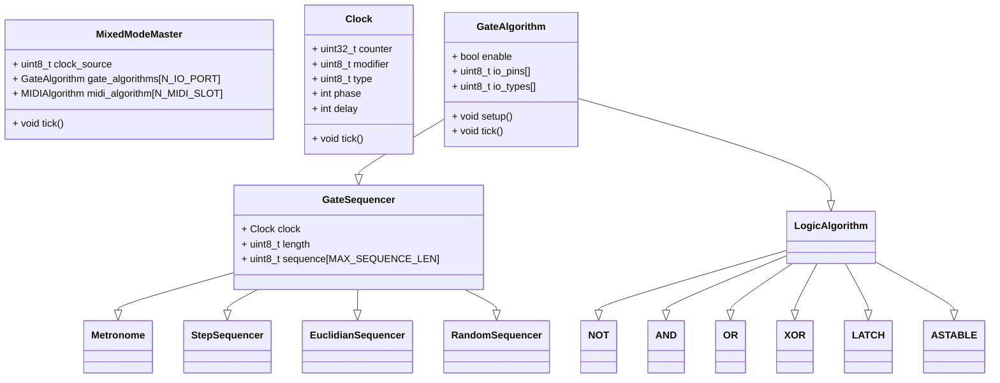

# MixedMode Modular Central (MMMC)

An expandable Eurorack CV & MIDI processor based around a Teensy 4.1

It provides `N_IO_PORT = 8` configurable input / output ports. Each port can be assigned to it's own independant algorithms. 

MMMC supports MIDI I/O over several transports : DIN Midi (3.5mm TRS) and USB MIDI and USB Host. The class compliant USB device shows up as 4 independant MIDI ports when connected to a host computer.


## Basics

The MixedMode Modular Central (MMMC) can clock off three sources:

- Internal
- CV
- MIDI

The behaviour of the rest of the module should be the same regardless of the clock source. The MMMC will operate under a `PPQN = 24` (maybe 48?) master clock derived from any of the sources listed above.

Each I/O channel can be configured as either an **input** or an **output**. They can be assigned to their own **algorithm** or be part of an algorithm that uses multiple inputs and/or outputs.

Each MIDI I/O can be routed to each other and MIDI Modifier Algorithms can be applied independently. 

## Output Algorithms

### Clock Dividers / Multipliers

Each output channel will have its own independant clock divider / multiplier. This will drive the refresh rate at which the algorithms will operate.

Each clock has its own independent `phase` which represents

### Gate Sequencers

The MMMC offers several types of gate sequencers:

- `Metronome` : every tick of the clock is outputted according to the clock multiplier/divider

- `StepSequencer` : a classic step sequencer with variable length (1-16). Each step can be ON/OFF.

- `EuclidianSequencer` : regular old Euclidian

- `RandomSequencer`: shred and load a random pattern

## Logic Algorithms

Configurable logic gates (all gates can also be inverted) & latches:

- `NOT`
- `AND`
- `NAND`
- `OR`
- `NOR`
- `XOR`
- `NXOR`
- `ASTABLE`
- `LATCH`

Logic algorithms are not clocked by the master clock and happen at a much higher sample rate

Decisions recorded for the logic gates:

- A gate folds its operation over every input in its mask, starting from the
  gate's identity element (1 for AND/NAND, 0 for OR/NOR/XOR/XNOR). **XOR over
  more than two inputs is therefore parity**: the output is high when an odd
  number of inputs is high. XNOR is the inverse.
- Gate inputs are normalised in the hardware layer (see `GATE_INPUT_ACTIVE_LOW`
  in `src/hardware.h`): an algorithm reads `1` when a gate is present at the
  jack and `0` otherwise, so an **unpatched input reads 0** and does not force
  an OR or XOR gate high.
- `NOT` and `Sustain` take exactly one input port. A mask selecting zero or
  several ports is rejected at construction (`is_valid()` is false) and the
  algorithm never touches the hardware.
- Ports start as inputs at boot. An algorithm claims its outputs in `setup()`
  and returns every port it claimed to an input when it is destroyed.

# Building

The toolchain is PlatformIO, installed into a project-local `.venv/`. A clone
needs nothing but `python3`:

```
make setup     # install PlatformIO and pre-fetch the toolchains (~600 MB, once)
make build     # build firmware for the Teensy 4.1
make test      # run the native unit tests, no hardware needed
make size      # flash and RAM usage
make upload    # flash an attached Teensy
```

`make` targets bootstrap PlatformIO on first use, so `make test` works in a
fresh clone on its own. Claude Code on the web provisions the same toolchain
through `.claude/hooks/session-start.sh` when a session starts.

The Teensy platform version in `platformio.ini` is pinned on purpose. The core
ships MIDI Library and USBHost_t36, so the platform pin is what makes those
dependencies reproducible — an unpinned build resolves whatever the registry
published most recently, and that has already broken this project's DIN MIDI
settings once.

Our sources are compiled with `-Wall -Wextra -Weffc++ -Wshadow -Werror`;
framework and library include paths are passed as `-isystem`
(`scripts/project_warnings.py`) so that `-Werror` judges our code and not the
Teensy core's headers, which are included through
`src/hal/teensy/teensy_includes.h`. Headers live next to their sources
under `src/`; the `include/` and `lib/` directories are not used.

## Versions and releases

`VERSION` at the repository root is the single source of truth. Every build
stamps it into the binary along with `git describe`, reachable from firmware as
`MMMC_VERSION`, `MMMC_GIT_REV` and `MMMC_BUILD` (see `src/version.h`), and
printed to the serial console at startup:

```
MMMC 0.1.0+cbb862d
```

CI builds every push and pull request, and attaches the resulting `.hex` and
`.elf` to the run for 14 days, so any branch can be flashed and tried without
cutting a release.

To publish a release:

1. Update `VERSION` and commit it.
2. Tag the commit `v<version>` and push the tag.

```
git tag -a v0.2.0 -m "MMMC 0.2.0"
git push origin v0.2.0
```

The release workflow refuses to publish if the tag and `VERSION` disagree, then
runs the tests, builds firmware, and publishes a GitHub Release carrying
`mmmc-v<version>-teensy41.hex`, the matching `.elf`, and `SHA256SUMS`.

## Tests

The hardware is behind two narrow interfaces, `IGpio` (`src/hal/igpio.h`) and
`IMidiOut` (`src/hal/imidi_out.h`). The Teensy implementations live in
`src/hal/teensy/`; the fakes used by the tests (`FakeGpio`, `RecordingMidiOut`)
live in `test/fakes/`. Everything else is framework-free and is built on the
host by the `native` environment:

```sh
pio test -e native
```

Nothing under `src/algorithm/` includes `Arduino.h`.

CI (`.github/workflows/ci.yml`) builds the firmware and runs the native tests
on every push to `main` and on every pull request.

# Signal bus model

Algorithms do not bind to hardware. They read and write **internal buses**,
and the hardware ports are nodes too. An internal bus is a virtual patch cable.

| Domain | Carries | Buses | Fan-in rule |
|---|---|---|---|
| Gate | a level (`bool`) | 16 | OR of all writers (a passive mult) |
| Note | MIDI events (notes, CC, bend, ...) | 8 | arrival order; overflow is counted, never silent |
| CV | `int16_t` | 8 | sum with saturation (reserved for #8) |

Buses are **double-buffered**: readers see the previous pass, writers write
the next, and `BusManager::swap()` publishes. Evaluation is therefore
order-independent, feedback is a one-pass delay instead of a hang (a `NOT`
feeding itself oscillates at half the pass rate), and every pass is
deterministic. Each processing stage costs exactly one pass of latency, which
at gate rate is microseconds.

Every pass, `MixedModeMaster` runs:

1. hardware input nodes (`GateInPort`, `MidiInPort`) sample and write their buses;
2. pool nodes `process()`;
3. if a clock tick fired, nodes that subscribe `tick()` (the clock is not a bus:
   a tick carries a count, see #4);
4. swap;
5. hardware output nodes (`GateOutPort`, `MidiOutPort`) read their buses and
   drive the jacks and transports.

**Nodes.** Every algorithm is a `Node` (`src/node/node.h`). It is described by
an `AlgorithmDescriptor` in the registry (`src/node/registry.cpp`): id, name,
inlets and outlets with their *domain*, parameter count, state size, and a
placement-new constructor. A `NodeConfig` (also the preset format) selects an
algorithm by id and gives a bus index per inlet and outlet; the index is
interpreted in the domain the descriptor declares, and the validator rejects
an index that is out of range for that domain. `NO_BUS` leaves an optional
inlet unconnected.

**Allocation.** All algorithm code is always resident. Instances live in a
static pool of `N_NODE = 32` uniform slots (`NODE_SLOT_SIZE` bytes each, checked
per class with `static_assert`), placement-new'd on patch load and destroyed
explicitly on unload. The 8 jacks and the MIDI endpoints are reserved nodes
owned by the master, outside the pool, so a patch cannot delete its own MIDI
output. **There is no heap allocation after boot**; the native tests assert
it by instrumenting `operator new`.

Sizing constants live in `src/config.h`. Algorithm ids in
`src/node/registry.h` are part of the preset format: append, never renumber.

Algorithms available today: `NOT`, `AND`, `NAND`, `OR`, `NOR`, `XOR`, `XNOR`
(up to four inlets each), `Sustain` (gate to CC), `GateToNote` (gate edge to
note on/off), `Transpose`, and a minimal `Arpeggiator` (up, one octave; #10
extends it).

# Code structure

`Setters` and `Getters` are not represented in the diagram below. 



# Control & Feedback

The module has one encoder and two switches.
Each output has an RGB LED indicating the signal status and algorithm used.
A small square OLED is present to help with settings

A tight integration with Novation Launchpads using the DAW mode would be great. This would allow for additional control and feedback.